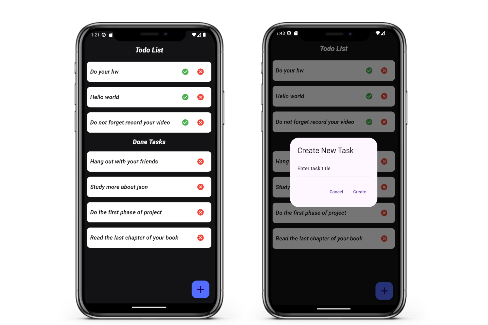

# Overview

This project is a simple Todo List application built using Flutter for the frontend and Java for the backend server. The app allows users to view, add, and manage tasks, with task data fetched from a remote server. The app and server communicate over a network socket to exchange task data in JSON format.

# Features

- Add Tasks: Users can add new tasks by entering the task title in a dialog box.
- Display Tasks: Tasks are fetched from a backend server and displayed in two categories: pending tasks and completed tasks.
- Mark Tasks as Done: Users can mark tasks as completed, moving them to the "Done Tasks" section.
- Remove Tasks: Both pending and completed tasks can be removed.

# Demo

# Project structure

## branch overview

There are two branches in this repository. The main branch contains a pure Flutter-Dart implementation, while the JSON branch includes the backend and transfers data using JSON (without storing it in a database).

## Frontend
- Language: Dart
- UI Framework: Flutter
- Socket Communication: The app connects to a backend server via a TCP socket to fetch and display tasks in real-time.

## Backend
- Language: Java
- Server Type: Socket-based server
- Task Handling: The server manages a list of tasks and responds to client requests for task data in JSON format.

## 🚀 About Me
- [@nforoutann](https://github.com/nforoutann)
I'm a Computer Engineering (Computer Science) student at Shahid Beheshti University, passionate about technology, a lifelong learner, and professional nerd.
